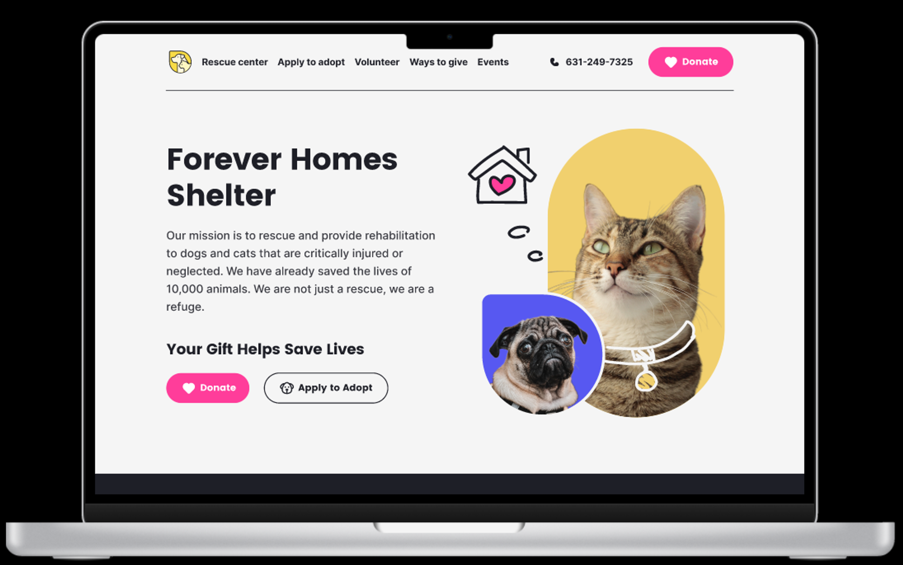

    <h1>Desafio de Código - Forever Homes Shelter</h1>
    

<h3>Estudante estagiário:
   <a href = "https://github.com/Claudierio"> Claudierio Baltazar </a> 
</h3>

<h1>Descrição do Desafio:</h1>
<h4>Você deve criar uma página web para um abrigo de animais fictício, que inclua informações sobre os animais disponíveis para adoção, detalhes sobre o abrigo e um formulário para assinar a newsletter.</h4>

<h1>Tarefas Principais:</h1>

<h4>Desenvolvimento da Página: Crie uma página web funcional de acordo com os protótipos fornecidos, garantindo que ela seja responsiva e que se adapte bem tanto a telas de desktop quanto a dispositivos móveis.</h4>
<h4>Exibição de Animais: Exiba os detalhes dos animais disponíveis para adoção na seção apropriada da página. Os detalhes incluem nome, foto, idade e botão para ver mais informações. Essas informações podem ser estáticas.</h4>
<h4>Formulário de assinatura de newsletter: Implemente um formulário deassinatura de newsletter. O formulário deve incluir campos para o e-mail e um botão de envio. Não é necessário implementar uma funcionalidade real de envio de e-mails, mas você pode usar JavaScript para validar os campos do formulário.</h4>
<h4>Estilo e Layout: Estilize a página de acordo com os protótipos fornecidos usando CSS. Certifique-se de que o layout seja atraente e que os elementos estejam bem distribuídos na página.</h4>

<h1>Tecnologias Usadas:</h1>

<ul>
   <li>HTML</li>
    <li>CSS</li>
    <li>JavaScript</li>
</ul>
